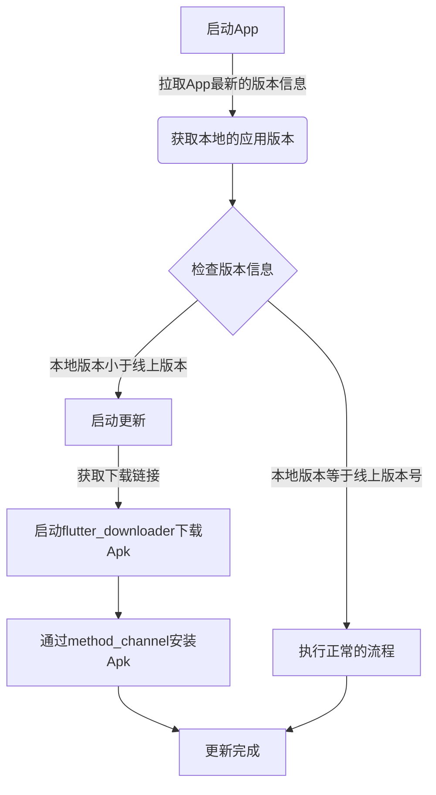

对于Flutter的更新，没有现成的模块可以使用，需要自己动手封装，App内的更新，是每个App需要考虑的事情，对于Android和iOS更新的机制是不一样的。
更新这块我们分为两个部分来说
- Android的更新
Android的应用内更新处理起来应该比较的简单，应用的App可以放在自己的网站进行下载，也可以放在公共的存储云上进行下载。在App启动的时候，检查App的更新，如果有新的App就下载。否者进行下一步流程。
- iOS的更新
由于iOS的特殊原因，iOS的更新，需要分为两个不分，1. 已经上架的App，2. 还未上架的App，这两个考虑是不一样的。这个处理起来要麻烦一些。这个我将在下一篇进行介绍。

在这一篇文章主要描述Flutter Android版本的App更新模块的设计与实现
## Andoird端更新流程
更新流程图



## 具体的代码实现
### Fluter端代码
#### 检查App的线上的最新版本
```
updateAppVersion() {
    if (Platform.isAndroid) {
      var req = SoftwareTabletIn();
//      req.id = API.build;
      NetUtils.post(
          url: API.softwareTabletInfo,
          params: req.toJson(),
          success: (result) {
            var bean = SoftwareTabletResp.fromJson(result);
            if (bean != null) {
              if (bean.buildVersion > API.build) {
                showDialog(
                    context: context,
                    child: AlertDialog(
                        title: Text("提示"),
                        content: Text("有新的版本(${bean.version})需要升级"),
                        actions: <Widget>[
                          FlatButton(
                              onPressed: () => Navigator.of(context).pop(),
                              child: Text("取消")),
                          FlatButton(
                              onPressed: () {
                                Navigator.of(context).pop(true);
                                _downloadAndInstall(bean);
                              },
                              child: Text("确定"))
                        ]));
              }
            }
          });
    }
  }
```

#### 下载Apk应用包
```
void _downloadAndInstall(SoftwareTabletResp bean) async {
    //权限判断
    var permission = PermissionGroup.storage;
    var accessStatus =
        await PermissionHandler().checkPermissionStatus(permission);
    if (accessStatus == PermissionStatus.granted) {
      executeDownload(bean.affixPath);
    } else {
      var requestStatus = await PermissionHandler()
          .requestPermissions(<PermissionGroup>[permission]);
      if (requestStatus[permission] == PermissionStatus.granted) {
        executeDownload(bean.affixPath);
      } else {
        Fluttertoast.showToast(msg: "请授权后重试");
      }
    }
  }
  
 // 下载
  Future<void> executeDownload(String downloadApkUrl) async {
    final path = await _apkLocalPath;
    //下载
    FlutterDownloader.initialize().then((e) {
      startDownload(downloadApkUrl, path);
    });
  }

  Future startDownload(String downloadApkUrl, String path) async {
    Future.delayed(Duration(milliseconds: 0), () {
      Global.loadingPage = LoadingPage(context);
      Global.loadingPage.show();
    });
    FlutterDownloader.registerCallback(downloadCallback);
    taskId = await FlutterDownloader.enqueue(
        url: downloadApkUrl,
        savedDir: path,
        fileName: "app-release.apk",
        showNotification: true,
        openFileFromNotification: true);
  } 
```

#### 通过`Method Channel`安装App
```
下载监听
static void downloadCallback(
      String id, DownloadTaskStatus status, int progress) {
    // 当下载完成时，调用安装
    if (status == DownloadTaskStatus.complete) {
      closeLoadingPage();
      _installApk();
    }
  }
  
// 安装
  static Future<Null> _installApk() async {
    try {
      final path = await _apkLocalPath;
      // 调用app地址
      _channel.invokeMethod('installApk', <String, dynamic>{
      "downloadUrl": downloadUrl
    }).then((e) {
        print(e);
      });
    } catch (_) {}
  }   
```
### Android端的代码实现
在Android原生端，主要实现App的安装，在这里也是有许多的坑的。
#### 安装代码的实现


#### AndroidManifest.xml配置
flutter_downloader配置
```


        <provider
            android:name="vn.hunghd.flutterdownloader.DownloadedFileProvider"
            android:authorities="${applicationId}.flutter_downloader.provider"
            android:exported="false"
            android:grantUriPermissions="true">
            <meta-data
                android:name="android.support.FILE_PROVIDER_PATHS"
                android:resource="@xml/provider_paths"/>
        </provider>

        <provider
            android:name="androidx.work.impl.WorkManagerInitializer"
            android:authorities="${applicationId}.workmanager-init"
            android:enabled="false"
            android:exported="false" />

        <provider
            android:name="vn.hunghd.flutterdownloader.FlutterDownloaderInitializer"
            android:authorities="${applicationId}.flutter-downloader-init"
            android:exported="false">
            <meta-data
                android:name="vn.hunghd.flutterdownloader.MAX_CONCURRENT_TASKS"
                android:value="5" />
        </provider>
        
        <provider
            android:name=".updateApk.UpdateFileProvider"
            android:authorities="com.sctuopuyi.hcms.downloadedfileprovider"
            android:exported="false"
            android:grantUriPermissions="true">
            <meta-data
                android:name="android.support.FILE_PROVIDER_PATHS"
                android:resource="@xml/provider_paths1"/>
        </provider>
```

provider_path1.xml
```
<?xml version="1.0" encoding="utf-8"?>
<paths xmlns:android="http://schemas.android.com/apk/res/android">
    <external-path name="external_files" path="."/>
</paths>
```

#### android 端method channel处理
```
override fun onMethodCall(call: MethodCall, result: Result){
    when (call.method) {
        "installApk" -> {
                try {
                    Log.i("updateApk", "开始下载软件包")
                    //更新APK
                    apkFileUrl = call.argument("downloadUrl")
//                    apkFileUrl = "/storage/emulated/0/Android/data/com.sctuopuyi.hcms/files/app-release.apk"
                    Log.i("updateApk", "获取参数成功")
                    val file = File(apkFileUrl)
                    Updater.install(this.applicationContext, file, true)
                } catch (e: Exception) {
                    e.printStackTrace()
                }
                result.success(null)
            }
    }
}
```


#### 安装Apk
```

public static void install(Context context, File file, boolean force) {
  Intent intent = new Intent(Intent.ACTION_VIEW);
  if (Build.VERSION.SDK_INT < Build.VERSION_CODES.N) {
            intent.setDataAndType(Uri.fromFile(file), "application/vnd.android.package-archive");
        } else {
            Uri uri = FileProvider.getUriForFile(context, context.getPackageName() + ".downloadedfileprovider", file);
            intent.setDataAndType(uri, "application/vnd.android.package-archive");
            intent.addFlags(Intent.FLAG_GRANT_READ_URI_PERMISSION);
        }
        intent.addFlags(Intent.FLAG_ACTIVITY_NEW_TASK);
        context.startActivity(intent);
}
```

到这里，`Flutter App android` 端的更新已经处理完毕。
